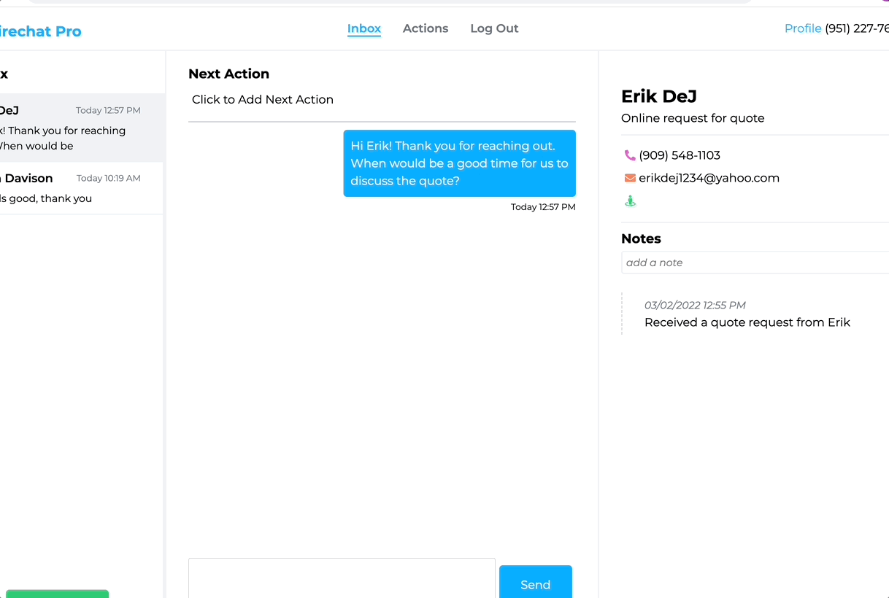
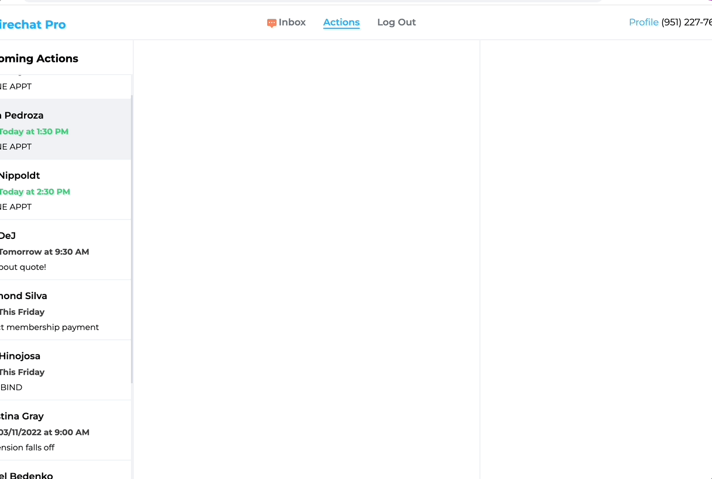

# 🔥 Firechat Pro - Front End Client

[🔥 Firechat Pro](https://firechat.pro) lets users send and receive SMS text messages while managing their client interactions in one simple platform.

### Features

- Send and Receive SMS Text Messages via Twilio API
- Save client contact data and notes
- Add "Next Action" todos for each client

## The Fortune is in the Follow Up!

### Sending a message and adding a followup action

Texting has proven to generate more engagement versus any other means of communication. Sending SMS text messages is at the very center of the Firechat Pro platform.

---

### Actions view of all upcoming actions to complete

Contact management focused only on what needs to be done next. Completed the sales action? Set the next one.

### Built With

#### Frontend

- React - Javascript Framework
- Styled Components - CSS in Javascript
- Recoil - Global State Management
- Firebase - Authentication
- SocketIO - Websockets

#### Backend

- NodeJS - Server Side Javascript Runtime
- Express JS - RESTful API Framework
- MongoDB - NoSql Database
- Twilio - SMS Texting API
- SocketIO - Websockets
